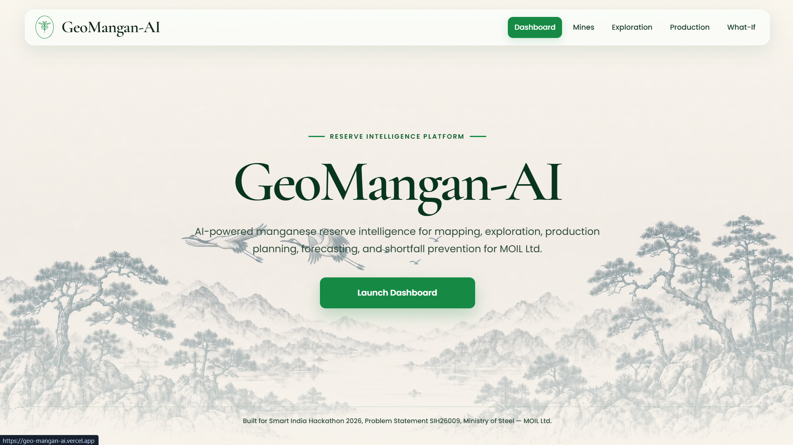
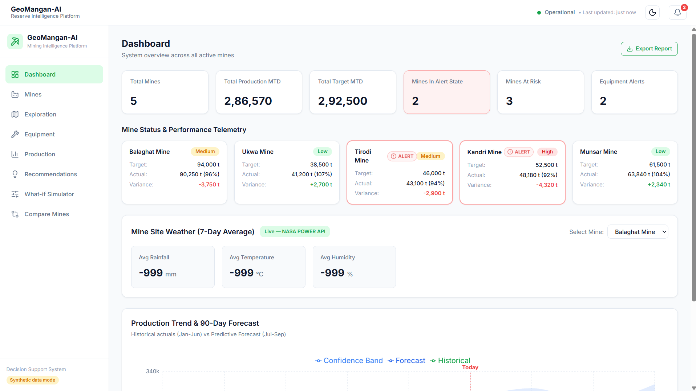
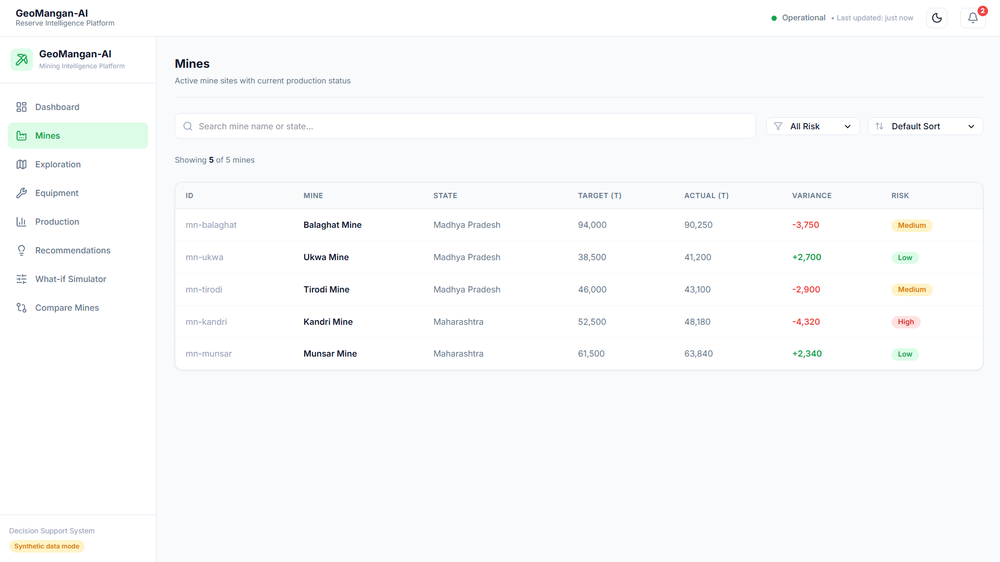
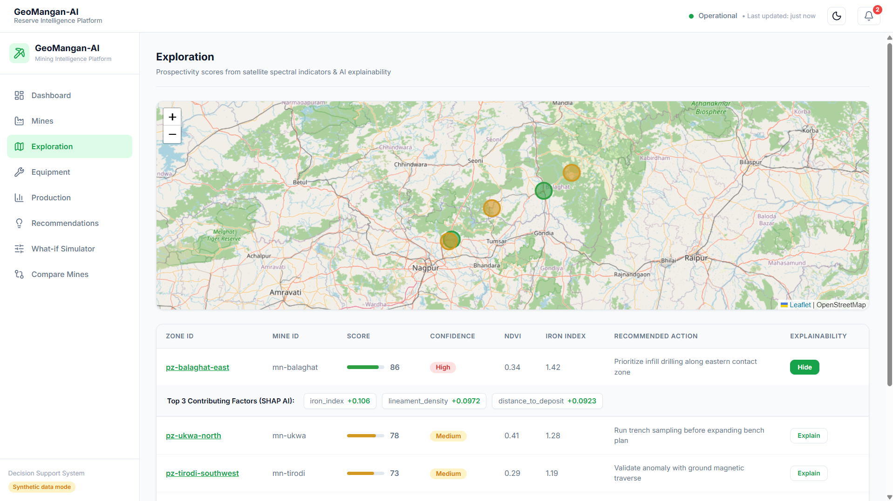
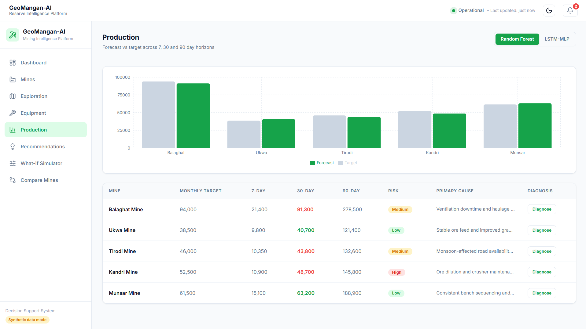
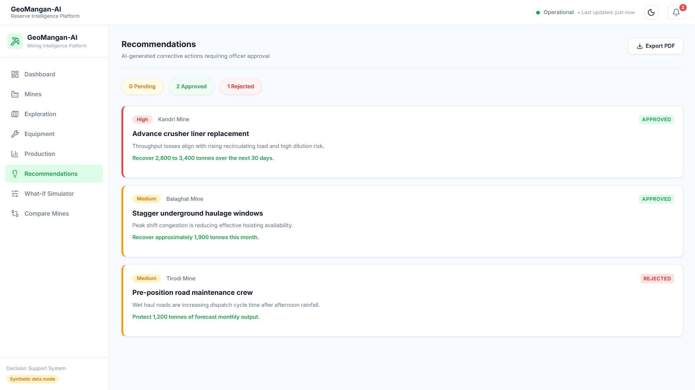
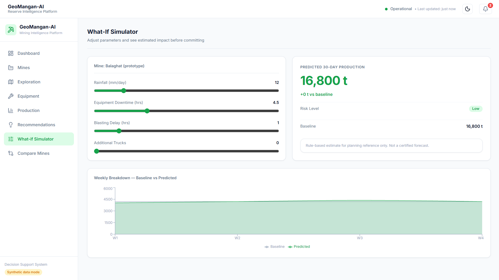
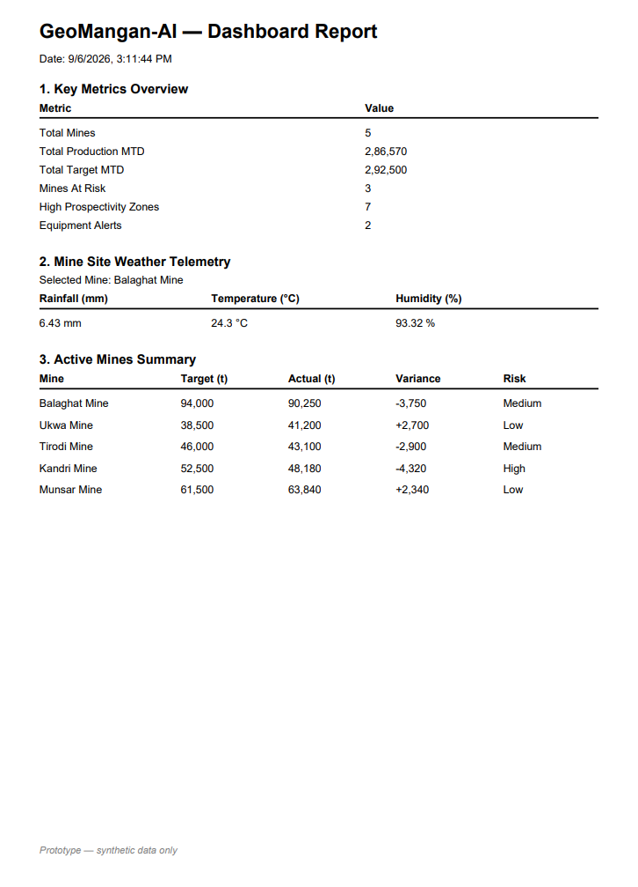
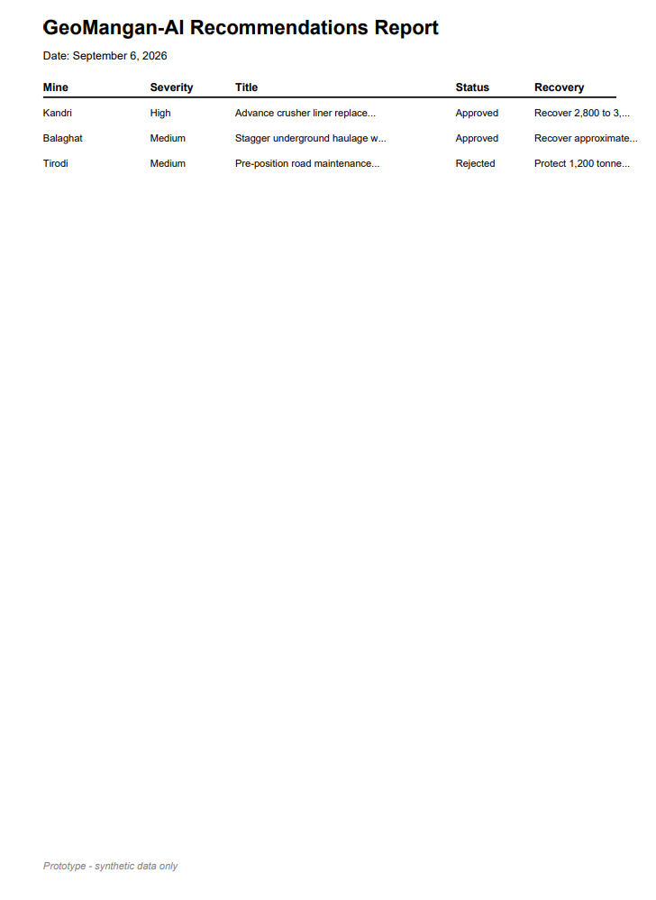

# GeoMangan-AI

**Intelligent Mining Decision-Support Platform**

GeoMangan-AI is an AI/ML and satellite-technology platform for manganese reserve prospectivity mapping and production shortfall prediction. Built for Smart India Hackathon 2026, Problem Statement SIH26009, Ministry of Steel — MOIL Ltd.

**Live Demo:** https://geo-mangan-ai.vercel.app
**Landing Page:** https://geo-mangan-ai.vercel.app/landing
**API Docs:** https://geomangan-ai.onrender.com/docs
**GitHub:** https://github.com/sahariya-divyansh/GeoMangan-AI

---

## Quick Start

### Prerequisites

- Python 3.11 or higher
- Node.js 20 or higher
- Git

### Backend

```bash
cd backend
python -m venv venv
venv\Scripts\activate
pip install -r requirements.txt
uvicorn app.main:app --reload --port 8000
```

### Frontend

```bash
cd frontend
npm install
npm run dev
```

Open browser at `http://localhost:5173`

---
## Screenshots

### Landing Page


### Dashboard


### Mines


### Exploration Map


### Production Forecasting


### Recommendations


### What-If Simulator


### PDF Export — Dashboard Report


### PDF Export — Recommendations Report


---

## What It Does

GeoMangan-AI helps mining teams answer four operational questions:

1. Where should exploration efforts be prioritised?
2. How much production can a mine realistically achieve?
3. Is a production shortfall likely to occur?
4. What actions could reduce the expected shortfall?

The platform follows a continuous operational loop:

```
Explore → Estimate → Schedule → Monitor → Correct → Explore
```

---

## Features

| Page | What it does |
|---|---|
| Dashboard | System overview — stat cards, production trend chart, live NASA weather panel |
| Mines | All active mines with target vs actual, variance, risk classification |
| Exploration | Leaflet prospectivity map with SHAP explainability per zone |
| Production | Forecast table, bar chart, shortfall diagnosis, LSTM model toggle |
| Recommendations | AI-generated corrective actions with approve/reject workflow and PDF export |
| What-If Simulator | Slider-based scenario planning with live production impact calculation |

---

## Technology Stack

**Frontend**
- React 18, TypeScript, Vite
- React Router, Tailwind CSS
- Leaflet / React-Leaflet
- Recharts
- jsPDF

**Backend**
- Python, FastAPI, Pydantic, Uvicorn
- SQLAlchemy, SQLite (PostGIS-ready schema)

**Machine Learning**
- scikit-learn: RandomForestClassifier, MLPRegressor, IsolationForest
- XGBoost: production forecasting
- SHAP: explainability
- Rule-based IF/THEN engine: shortfall diagnosis

**Data**
- NASA POWER API: real live weather data
- Synthetic MOIL-schema datasets

**Deployment**
- Frontend: Vercel
- Backend: Render
- Uptime: UptimeRobot
- Docker + docker-compose

---

## API Endpoints

| Method | Endpoint | Description |
|---|---|---|
| GET | /api/mines | All mines |
| GET | /api/mines/{id} | Single mine |
| GET | /api/exploration | Prospectivity zones |
| GET | /api/production | Forecast rows |
| POST | /api/production/diagnose | Shortfall diagnosis |
| POST | /api/production/lstm-forecast | LSTM-MLP forecast |
| GET | /api/recommendations | Corrective actions |
| PATCH | /api/recommendations/{id}/decide | Approve or reject |
| POST | /api/whatif | What-if simulation |
| POST | /api/predict/zone | ML prospectivity prediction |
| POST | /api/predict/production | ML production prediction |
| POST | /api/predict/anomaly | Equipment anomaly detection |
| POST | /api/predict/explain | SHAP feature explanation |
| GET | /api/weather/{mine_id} | Live NASA POWER weather |

Full docs: https://geomangan-ai.onrender.com/docs

---

## Synthetic Data Schema

Files in `data/synthetic/` define the target schemas for real MOIL data integration.

```
mines.csv              mine_id, mine_name, state, latitude, longitude, monthly_target_tonnes
production.csv         date, mine_id, target, actual, grade, downtime_hours, blast_delay_hours
equipment.csv          date, mine_id, equipment_type, available_hours, operating_hours, downtime_reason
drill_samples.csv      sample_id, mine_id, latitude, longitude, depth_m, mn_grade_percent
satellite_features.csv grid_id, mine_id, ndvi, iron_index, swir_ratio, slope, lineament_density
```

---

## Deployment

### Backend — Render

1. New Web Service, connect GitHub repo
2. Root Directory: `backend`
3. Build Command: `pip install -r requirements.txt`
4. Start Command: `uvicorn app.main:app --host 0.0.0.0 --port $PORT`
5. Env var: `DATABASE_URL=sqlite:///./geomangan.db`

### Frontend — Vercel

1. New Project, connect GitHub repo
2. Root Directory: `frontend`
3. Env var: `VITE_API_URL=https://geomangan-ai.onrender.com`
4. Deploy

### Keep Backend Alive — UptimeRobot

Monitor: `https://geomangan-ai.onrender.com/health` every 5 minutes

---

## Roadmap

| Phase | Scope |
|---|---|
| Phase 1 | Prototype — synthetic data, all pages, ML models, deployed |
| Phase 2 | Pilot — real MOIL data, model validation |
| Phase 3 | Multi-mine — all 11 mines, telemetry, alerts |
| Phase 4 | Enterprise — 3D twin, ERP integration, government cloud |

---

## Disclaimer

GeoMangan-AI is a prototype decision-support platform. All outputs are model-generated and do not constitute certified geological reserves or guaranteed production figures. The prototype uses synthetic operational data.

---

## License

MIT License
